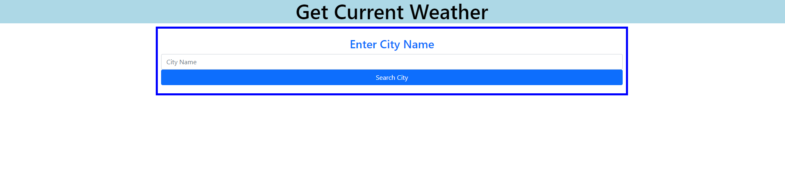
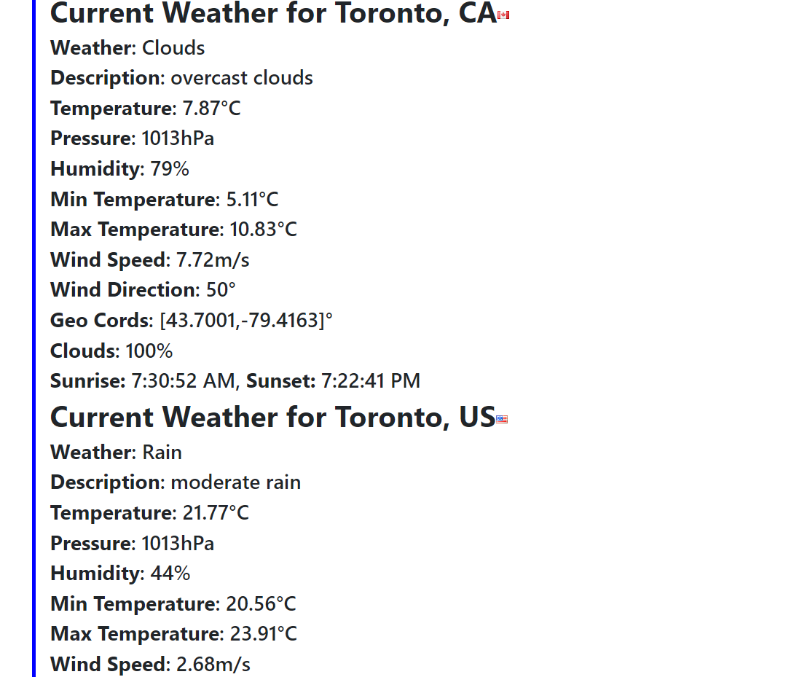

# WeatherAPI
Retrieves live weather data from API and displays it based on user input.

To run the program, download and extract the files onto your computer and run index.html with a browser to open the program.

